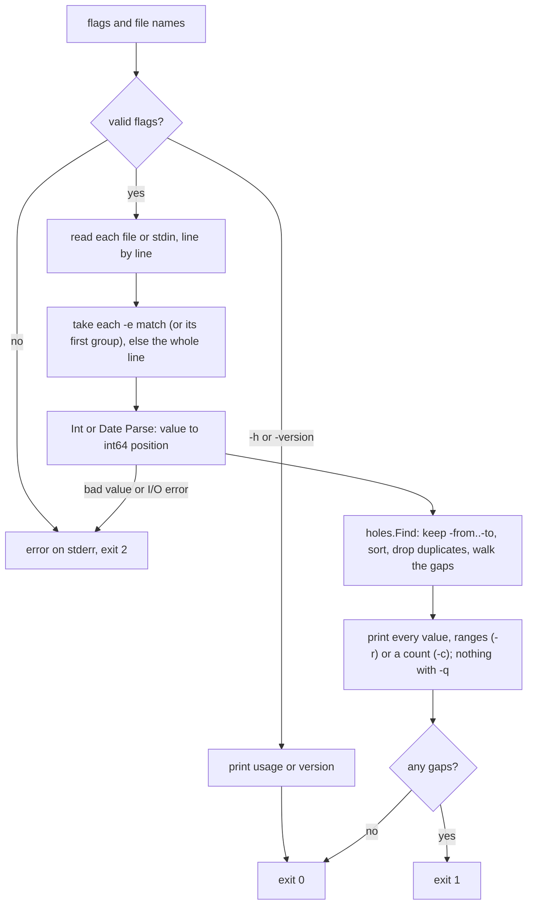

# holes

Print the values missing from a sequence.

```console
$ ls backups/
db-2026-09-19.tar.gz  db-2026-09-21.tar.gz  notes.txt
$ ls backups/ | holes -t date -e '\d{4}-\d{2}-\d{2}' -to 2026-09-22
2026-09-20
2026-09-22
```

`holes` is a small Unix filter in the spirit of `uniq` and `comm`: text in,
missing values out, and an exit status you can branch on. It is also a
dependency-free Go library.

## Why

Finding gaps usually means an awk one-liner or `comm -23 <(seq 1 N | sort) <(sort -u file)`,
which needs the range up front and only handles integers. `holes`:

- works out the range from the input (or takes `-from`/`-to`),
- understands dates, not just integers, with any Go date layout,
- pulls values out of noisy lines (`-e` regexp), such as filenames,
- accepts unsorted input with duplicates,
- prints single values, compact ranges (`-r`) or a count (`-c`),
- exits 1 when something is missing, so it drops straight into cron and CI.

## Install

Download the binary for your platform from the
[latest release](https://github.com/rgravlin/holes/releases/latest). Assets
are named `holes-<os>-<arch>` (`.exe` on Windows) for Linux (amd64, arm64,
and arm for ARMv6 and later, including every Raspberry Pi), macOS (amd64,
arm64), Windows (amd64, arm64) and FreeBSD (amd64, arm64).

> [!NOTE]
> The commands below use holes-linux-amd64; substitute your platform's asset

### Latest Release
```sh
# download latest
curl -fsSLO https://github.com/rgravlin/holes/releases/latest/download/holes-linux-amd64

# download checksum
curl -fsSLO https://github.com/rgravlin/holes/releases/latest/download/SHA256SUMS
```

### Versioned Release
```sh
# setup version
VERSION=v1.0.0

# download versioned binary
curl -fsSLO "https://github.com/rgravlin/holes/releases/download/$VERSION/holes-linux-amd64"

# download versioned checksum
curl -fsSLO "https://github.com/rgravlin/holes/releases/download/$VERSION/SHA256SUMS"
```

### Final Steps
```sh
# validate checksums
sha256sum --ignore-missing -c SHA256SUMS

# optional: verify build provenance (needs gh)
#gh attestation verify holes-linux-amd64 -R rgravlin/holes

# make it executable and rename the binary
chmod +x holes-linux-amd64 && mv holes-linux-amd64 holes
```

Then move `holes` to a directory on your `PATH` (`echo "$PATH"` lists them),
or add its directory to `PATH`.

On any other platform, or to build from source, use Go (`@v1.0.0` for a
specific version):

```sh
go install github.com/rgravlin/holes/cmd/holes@latest
```

The CLI and library need Go 1.26 or later to build.

## Usage

```
holes [flags] [file ...]
```

Reads standard input when no file (or `-`) is given. Leading and trailing
whitespace is trimmed from each line, and blank lines are skipped. A UTF-8
byte-order mark at the start of an input is ignored.

| Flag             | Meaning                                                                                                                                                                                 |
|------------------|-----------------------------------------------------------------------------------------------------------------------------------------------------------------------------------------|
| `-t`, `-type`    | Value type: `int` (default) or `date`.                                                                                                                                                  |
| `-layout`        | Date layout in Go [time format](https://pkg.go.dev/time#pkg-constants); default `2006-01-02`. Requires `-type date`. Must include year, month and day (or year and day of year).        |
| `-width`         | Pad integers with leading zeros to at least N characters (`-width 4` prints `0002`); default 0, no padding. Requires `-type int`.                                                       |
| `-step`          | Distance between consecutive expected values (days for dates); default 1.                                                                                                               |
| `-from`, `-to`   | First and last expected values. Input outside them is ignored; missing values up to them are reported.                                                                                  |
| `-e`, `-extract` | Regexp selecting every value in each line: each match's first group if it has one, else the whole match. Anchor it (`^`) to take one value per line. Lines without a match are skipped. |
| `-r`, `-ranges`  | Print each gap as `first..last` instead of every value.                                                                                                                                 |
| `-c`, `-count`   | Print only the number of missing values.                                                                                                                                                |
| `-q`, `-quiet`   | Print nothing, even with `-c` or `-r`; use the exit status.                                                                                                                             |
| `-version`       | Print the version, plus the commit (and `+dirty`) when built from a git checkout.                                                                                                       |

Exit status: **0** nothing missing, **1** something missing, **2** error
(bad flag, unparsable value with its file and line number, I/O error).

### Examples

The same examples appear in `holes -h`, before the flag list.

```sh
# Did every nightly backup land? Alert if not.
ls /backups | holes -q -t date -e '\d{4}-\d{2}-\d{2}' -to "$(date +%F)" \
  || echo 'backup missing' >&2

# Which days have no log lines (service down, cron skipped)?
holes -t date -e '^\d{4}-\d{2}-\d{2}' app.log

# Which numbers are missing from a list on one line?
echo 'batches 1,2,3,5,8,9' | holes -e '\d+' -r

# How many order IDs are missing (deleted rows, rolled-back inserts)?
psql -Atc 'select id from orders' shop | holes -c

# Weekly reports named 20260901.pdf, 20260908.pdf, ...
ls reports | holes -t date -layout 20060102 -e '(\d{8})\.pdf' -step 7

# Missing render frames, padded like the file names (frame_0001.exr)
ls render | holes -e 'frame_(\d+)\.exr' -from 1 -to 240 -width 4
```

### How gaps are defined

Between two present values `a < b`, the expected values are `a+step`,
`a+2*step`, ... below `b`. The step re-anchors at every present value, so an
off-grid value does not make the rest of the sequence look missing. `-from`
is itself expected; `-to` is expected when it falls on the grid.

With no values inside the bounds (empty input, or everything before `-from`
or after `-to`), `-from` and `-to` together report their whole range as
missing, and either one alone reports itself. So an empty backup directory
still fails the backup check above.

Dates are taken as written: any time of day or zone in the input is dropped
before comparison.

## Library

```go
import "github.com/rgravlin/holes"

d := holes.Date{} // or holes.Int{}, or holes.Int{Width: 4} for 0001-style output
gaps, err := holes.Find(positions, holes.Options{Step: 1, To: &last})
for _, g := range gaps {
	fmt.Println(d.Format(g.First), d.Format(g.Last), g.Count)
	for p := range g.Values() { /* each missing position */ }
}
```

`Find` works on `int64` positions; `Int` and `Date` convert values to
positions (`Parse`) and back (`Format`), and any other type only needs its own
mapping to `int64`. `Find` never modifies its input and is safe across the full `int64`
range. See the [package docs](https://pkg.go.dev/github.com/rgravlin/holes).

## Development

Requires [just](https://github.com/casey/just) and
[golangci-lint](https://golangci-lint.run) v2.13.2. The `go` line in `go.mod`
is the oldest Go supported; development and CI build with the newer Go on the
`toolchain` line, which the `go` command downloads if needed and `just
modupdate` moves to the latest release. `go vet` flags any language feature or
standard library API newer than the `go` line. The other tools
(govulncheck, gitleaks, actionlint, benchstat) are pinned in `tools/go.mod`, outside the
root module so the library stays dependency-free, and run with `go tool`.

```sh
just test        # unit tests with -race
just fuzz        # fuzz each target, library and CLI (default 30s)
just bench       # run the benchmarks 10 times into bench.txt and summarize them
just benchstat bench-old.txt bench.txt  # compare two bench runs
just lint        # golangci-lint
just vuln        # govulncheck
just secrets     # gitleaks
just actionlint  # lint the GitHub Actions workflows
just verify      # go.mod tidiness (root and tools), no root dependencies, go vet, gofmt, go fix modernizers
just ci          # everything CI runs except lint (CI lints through its own action)
just check       # everything CI runs, plus lint
just modupdate   # update dependencies, including the dev tools in tools/go.mod
just dist        # cross-compile the CLI for the released platforms into dist/, with SHA256SUMS
```

To measure a performance change, run `just bench bench-old.txt` on the old
code and `just bench` on the new, then `just benchstat bench-old.txt
bench.txt`. Benchmark numbers depend on the machine, so compare only runs
from the same machine; CI does not run or check them.

`holes` has no configuration beyond flags and no environment variables.

### Releasing

Every merge to `main` updates a single draft release
([release workflow](.github/workflows/release.yml)): release notes and the
next version come from the merged pull requests
([config](.github/release-drafter.yml)), and `just dist` builds the binaries
from the merged commit, with signed build provenance, and attaches them. The
version bump is the highest label among the pull requests merged since the
last release: `major`, then `minor` or `enhancement`, else patch. Label a
pull request before merging it: labels are read when the merge runs the
workflow, so a label added later only counts from the next merge.

To release, wait for the Release workflow on the latest merge to finish, then
publish the draft. Publishing creates the tag on the commit the binaries were
built from, so `go install ...@<tag>` and the binaries report the same
version.

## Workflow Diagram



## License

MIT
